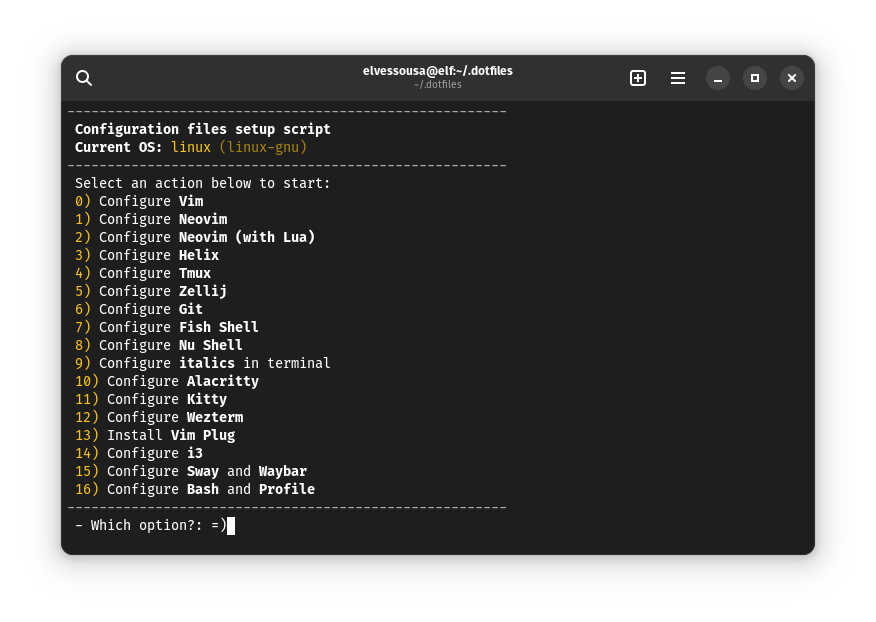

# Dotfiles

This repo is where I keep my dotfiles to set up my system the way I like it.

Configs available for the following programs:

- Alacritty
- Bash
- Fish Shell
- Git
- Helix
- i3
- Kitty
- NeoVim
- Nu Shell
- Sway
- Tmux
- Vim
- Waybar
- Wezterm
- Zellij

## How to use

- Clone this repo
- Run `sh ./configure.sh` and select an option
- ???
- Profit!
